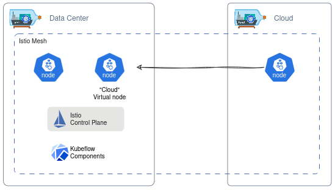
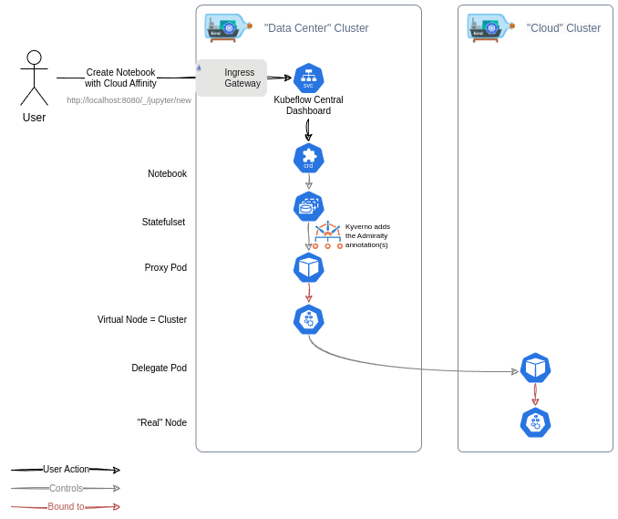

# Multi-Cluster Kubeflow
This is project is proof-of-concept for how one could go about running Kubeflow notebooks on multiple clusters. 

By using [Admiralty](https://admiralty.io/) for multi-cluster scheduling, we can achieve a [cloud bursting topology](https://admiralty.io/docs/concepts/topologies/#cloud-bursting) where a primary "Data Center" cluster can be used to run the istio Control Plane, the Kubeflow Components as well provide a fixed compute resource amount, while a secondary "Cloud" cluster can [meshed with it via Istio](https://istio.io/latest/docs/setup/install/multicluster/primary-remote/) provide elastic compute capacity to the platform.

In this repo, 2 local kind clusters are created to demonstrate the above scenario:

.


.

---
## Demo
https://github.com/user-attachments/assets/50d1bbdf-1bca-4a55-b39d-87dcf238dc9b


## Setup
### Prerequisites
Ensure all dependencies are available in your systemd:
```shell
make dependencies
```

### Install
#### Single command
```shell
make all
```

#### Step by step equivalent
```shell
make up # create clusters and configure admiralty
make istio # configure istio mesh
make kubeflow # install, configure and expose kubeflow
```

### Testing
```shell
make test # test istio, admiralty and kubeflow setups
```

### My configuration
- OS: Ubuntu 22.04, Arch: amd64
- [make](https://www.gnu.org/software/make/): `4.3`
- [bash](https://www.gnu.org/software/bash/): `5.1.16`
- [kind](https://kind.sigs.k8s.io/): `kind v0.23.0 go1.21.10 linux/amd64`
- [istio/istioctl](https://github.com/istio/istio): `1.23.2`

---
## Sources
- https://admiralty.io/docs/
- https://istio.io/v1.23/docs/setup/install/multicluster/primary-remote/
- https://github.com/mlkmhd/istio-multi-cluster-initializer/tree/8aad469ff6f5ece7e01f9c1f9e76375ac1c5ece9
- https://github.com/kubeflow/manifests/tree/v1.9.0
